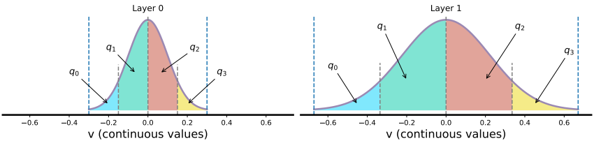

# LIMPQ (Mixed-Precision Neural Network Quantization via Learned Layer-wise Importance)

Official implementation for paper "Mixed-Precision Neural Network Quantization via Learned Layer-wise Importance"




## Abstract

The exponentially large discrete search space in mixed-precision quantization (MPQ) makes it hard to determine the optimal bit-width for each layer. Previous works usually resort to iterative search methods on the training set, which consume hundreds or even thousands of GPU-hours. In this study, we reveal that some unique learnable parameters in quantization, namely the scale factors in the quantizer, can serve as importance indicators of a layer, reflecting the contribution of that layer to the final accuracy at certain bit-widths. These importance indicators naturally perceive the numerical transformation during quantization-aware training, which can precisely provide quantization sensitivity metrics of layers. However, a deep network always contains hundreds of such indicators, and training them one by one would lead to an excessive time cost. To overcome this issue, we propose a joint training scheme that can obtain all indicators at once. It considerably speeds up the indicators training process by parallelizing the original sequential training processes. With these learned importance indicators, we formulate the MPQ search problem as a one-time integer linear programming (ILP) problem. That avoids the iterative search and significantly reduces search time without limiting the bit-width search space. For example, MPQ search on ResNet18 with our indicators takes only 0.06 seconds, which improves time efficiency exponentially compared to iterative search methods. Also, extensive experiments show our approach can achieve SOTA accuracy on ImageNet for far-ranging models with various constraints (e.g., BitOps, compress rate).


## Usage

### Joint Training for The Layer-wise Importance Indicators

In Progress


## ILP-based Mixed-Precision Searching

In Progress


### Fine-tuning

In Progress


## Citation

```
@inproceedings{tang2022mixed,
  title={Mixed-Precision Neural Network Quantization via Learned Layer-wise Importance},
  author={Tang, Chen and Ouyang, Kai and Wang, Zhi and Zhu, Yifei and Wang, Yaowei and Ji, Wen and Zhu, Wenwu},
  booktitle={European Conference on Computer Vision},
  year={2022}
}
```

